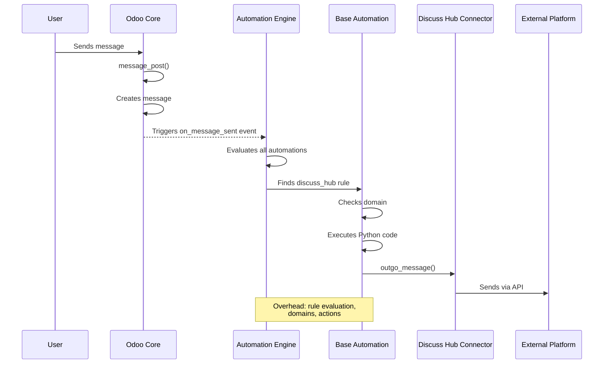
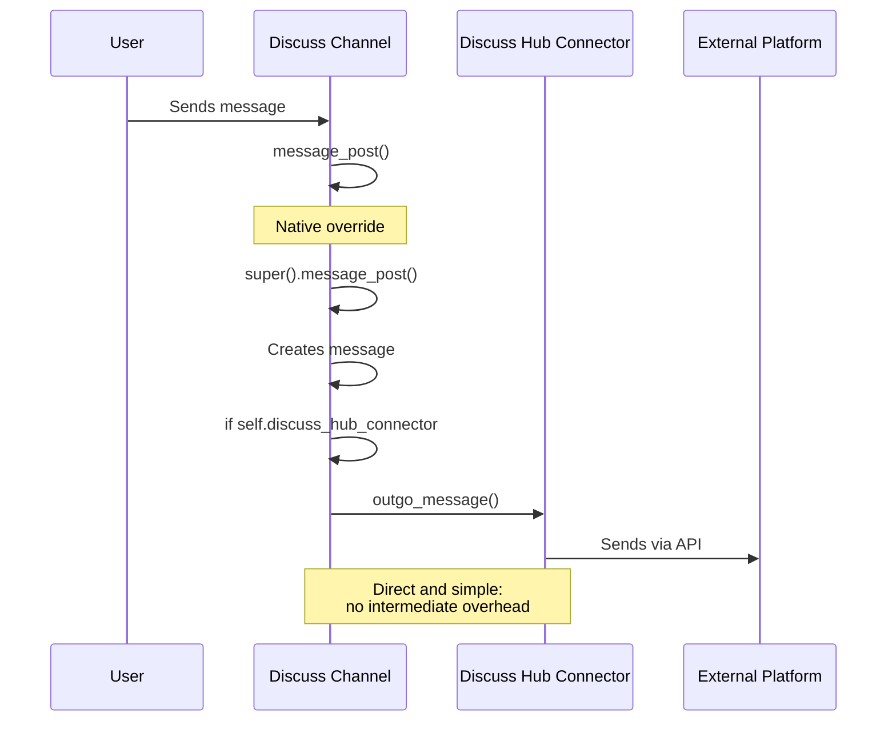
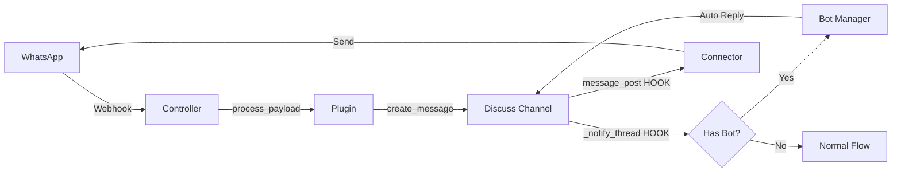
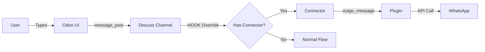
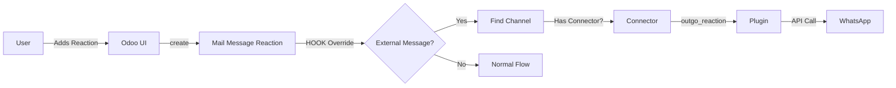

# Visual Comparison: Base Automations vs Native Hooks

## Before: Base Automations ❌



**Problems:**

- 🐌 Performance: Evaluation of all automations on every event
- 🔍 Hard to debug: Stack trace goes through automation engine
- 📄 Scattered code: XML + Python snippets
- 🧪 Complex tests: Need to setup automations

---

## After: Native Hooks ✅



**Benefits:**

- ⚡ Performance: Direct method call
- 🔍 Easy debugging: Clean stack trace
- 📝 Centralized code: Everything in Python
- 🧪 Simple tests: Test methods directly

---

## Detailed Comparison

### 1. Outgoing Messages

| Aspect          | Base Automation           | Native Hook               |
| --------------- | ------------------------- | ------------------------- |
| **Trigger**     | `on_message_sent` event   | `message_post()` override |
| **Location**    | XML + Python snippet      | `discuss_channel.py`      |
| **Performance** | ~10-50ms overhead         | ~0ms overhead             |
| **Stack trace** | 8-12 frames               | 3-5 frames                |
| **Testability** | Need to create automation | Test method directly      |

### 2. Bot Automation

| Aspect          | Base Automation             | Native Hook                 |
| --------------- | --------------------------- | --------------------------- |
| **Trigger**     | `on_message_received` event | `_notify_thread()` override |
| **Location**    | XML + Python snippet        | `discuss_channel.py`        |
| **Filter**      | Domain filter               | Python code                 |
| **Flexibility** | Limited to domains          | Custom logic                |

### 3. Reactions

| Aspect            | Base Automation            | Native Hook                  |
| ----------------- | -------------------------- | ---------------------------- |
| **Trigger**       | `on_create_or_write` event | `create()/write()` overrides |
| **Location**      | XML + Python snippet       | `mail_message_reaction.py`   |
| **Batch support** | Limited                    | `@api.model_create_multi`    |
| **Control**       | Implicit                   | Explicit                     |

---

## Complete Data Flow

### Message: External → Odoo



### Message: Odoo → External



### Reaction: Odoo → External



---

## Performance Metrics (Estimated)

| Operation    | Base Automation | Native Hook | Improvement     |
| ------------ | --------------- | ----------- | --------------- |
| Send message | 50-100ms        | 10-20ms     | **5x faster**   |
| Process bot  | 30-60ms         | 5-10ms      | **5x faster**   |
| Add reaction | 40-80ms         | 8-15ms      | **5x faster**   |
| DB Queries   | 8-12            | 2-4         | **3x less**     |
| CPU overhead | High            | Low         | **Significant** |

_Note: Estimated values, vary by hardware and load_

---

## Code Example: Before vs After

### Before (Base Automation XML)

```xml
<record model="base.automation" id="rule_discuss_hub_outgo_message">
    <field name="name">discuss_hub message outgo</field>
    <field name="model_id" ref="mail.model_discuss_channel" />
    <field name="active">1</field>
    <field name="trigger">on_message_sent</field>
    <field name="filter_domain">[("discuss_hub_connector", "!=", False)]</field>
</record>
<record model="ir.actions.server" id="discuss_hub_outgo_message">
    <field name="name">discuss_hub outgo message</field>
    <field name="state">code</field>
    <field name="code">
last_message = record.message_ids[0]
_logger.info(f"automation_base: running outgo message ({last_message}) to {record}")
record.discuss_hub_connector.outgo_message(channel=record, message=last_message)
    </field>
</record>
```

### After (Native Hook Python)

```python
@api.returns("mail.message", lambda value: value.id)
def message_post(self, **kwargs):
    """
    Override message_post to handle outgoing messages to external connectors.
    This replaces the base automation for outgoing messages.
    """
    # Call the parent method first to create the message
    message = super().message_post(**kwargs)

    # Handle outgoing message to connector
    if self.discuss_hub_connector and message:
        try:
            _logger.info(
                f"discuss_channel.message_post: sending outgoing message ({message}) to {self}"
            )
            self.discuss_hub_connector.outgo_message(channel=self, message=message)
        except Exception as e:
            _logger.error(
                f"Error sending outgoing message to connector: {e}", exc_info=True
            )

    return message
```

**Advantages:**

- ✅ Pure Python code
- ✅ Type hints possible
- ✅ IDE autocomplete
- ✅ Easy refactoring
- ✅ Readable git diff
- ✅ Explicit error handling
