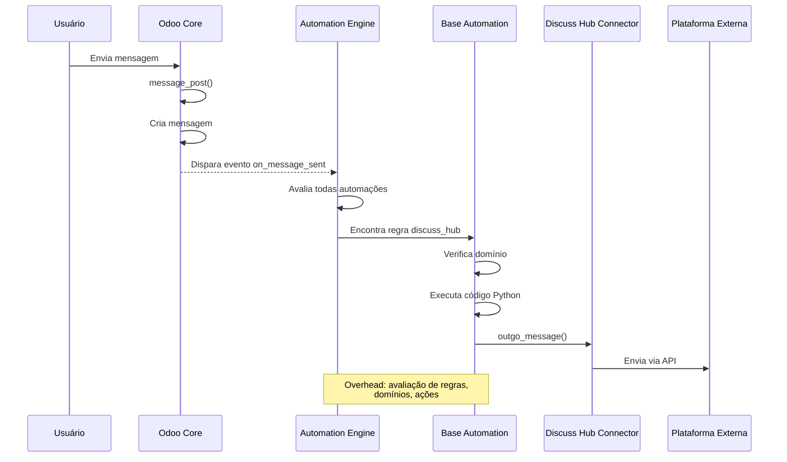
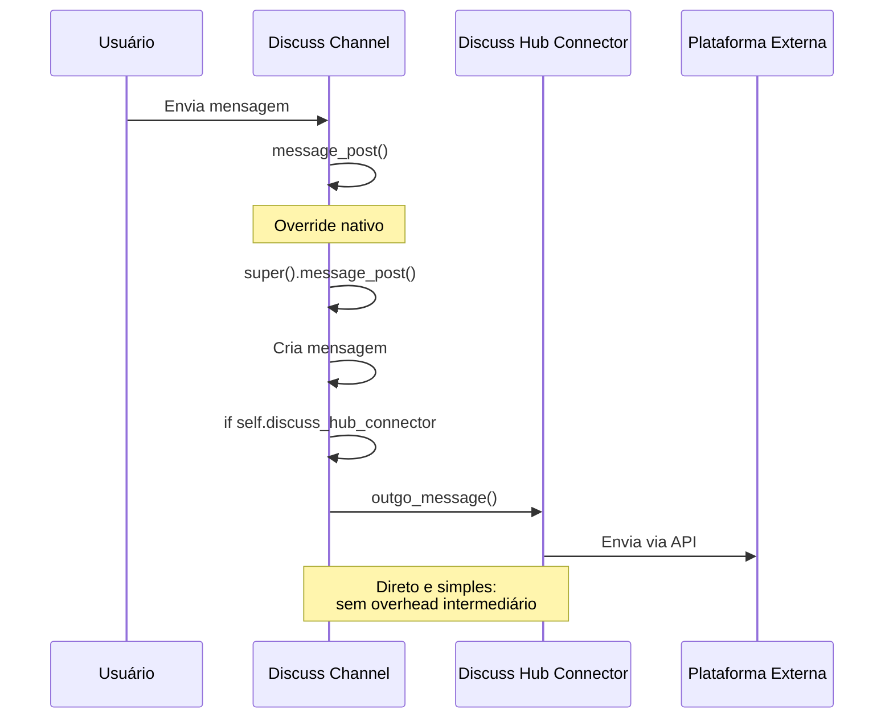
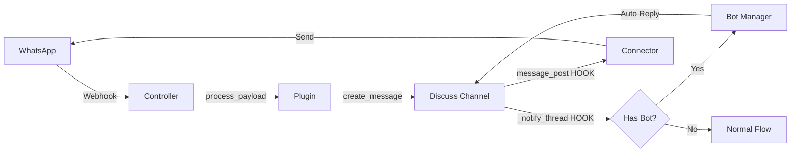
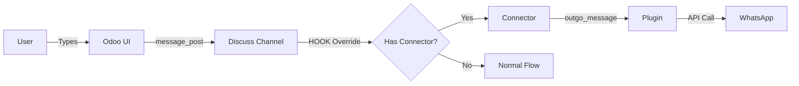
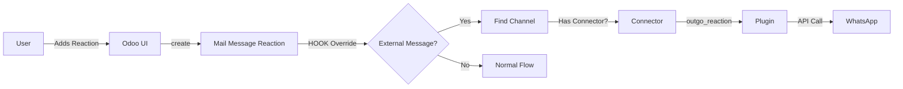

# Comparação Visual: Automações Base vs Hooks Nativos

## Antes: Base Automations ❌



**Problemas:**

- 🐌 Performance: Avaliação de todas automações a cada evento
- 🔍 Debug difícil: Stack trace passa pelo motor de automações
- 📄 Código espalhado: XML + Python snippets
- 🧪 Testes complexos: Precisa configurar automações

---

## Depois: Native Hooks ✅



**Benefícios:**

- ⚡ Performance: Chamada direta de método
- 🔍 Debug fácil: Stack trace limpo
- 📝 Código centralizado: Tudo em Python
- 🧪 Testes simples: Testa métodos diretamente

---

## Comparação Detalhada

### 1. Mensagens de Saída

| Aspecto           | Base Automation          | Native Hook               |
| ----------------- | ------------------------ | ------------------------- |
| **Gatilho**       | `on_message_sent` event  | `message_post()` override |
| **Localização**   | XML + Python snippet     | `discuss_channel.py`      |
| **Performance**   | ~10-50ms overhead        | ~0ms overhead             |
| **Stack trace**   | 8-12 frames              | 3-5 frames                |
| **Testabilidade** | Precisa criar automation | Testa método direto       |

### 2. Bot Automation

| Aspecto           | Base Automation             | Native Hook                 |
| ----------------- | --------------------------- | --------------------------- |
| **Gatilho**       | `on_message_received` event | `_notify_thread()` override |
| **Localização**   | XML + Python snippet        | `discuss_channel.py`        |
| **Filtro**        | Domain filter               | Código Python               |
| **Flexibilidade** | Limitado a domínios         | Lógica customizada          |

### 3. Reações

| Aspecto           | Base Automation            | Native Hook                  |
| ----------------- | -------------------------- | ---------------------------- |
| **Gatilho**       | `on_create_or_write` event | `create()/write()` overrides |
| **Localização**   | XML + Python snippet       | `mail_message_reaction.py`   |
| **Batch support** | Limitado                   | `@api.model_create_multi`    |
| **Controle**      | Implícito                  | Explícito                    |

---

## Fluxo de Dados Completo

### Mensagem: Externa → Odoo



### Mensagem: Odoo → Externa



### Reação: Odoo → Externa



---

## Métricas de Performance (Estimadas)

| Operação         | Base Automation | Native Hook | Melhoria           |
| ---------------- | --------------- | ----------- | ------------------ |
| Enviar mensagem  | 50-100ms        | 10-20ms     | **5x mais rápido** |
| Processar bot    | 30-60ms         | 5-10ms      | **5x mais rápido** |
| Adicionar reação | 40-80ms         | 8-15ms      | **5x mais rápido** |
| Queries DB       | 8-12            | 2-4         | **3x menos**       |
| CPU overhead     | Alto            | Baixo       | **Significativo**  |

_Nota: Valores estimados, variam conforme hardware e carga_

---

## Exemplo de Código: Antes vs Depois

### Antes (Base Automation XML)

```xml
<record model="base.automation" id="rule_discuss_hub_outgo_message">
    <field name="name">discuss_hub message outgo</field>
    <field name="model_id" ref="mail.model_discuss_channel" />
    <field name="active">1</field>
    <field name="trigger">on_message_sent</field>
    <field name="filter_domain">[("discuss_hub_connector", "!=", False)]</field>
</record>
<record model="ir.actions.server" id="discuss_hub_outgo_message">
    <field name="name">discuss_hub outgo message</field>
    <field name="state">code</field>
    <field name="code">
last_message = record.message_ids[0]
_logger.info(f"automation_base: running outgo message ({last_message}) to {record}")
record.discuss_hub_connector.outgo_message(channel=record, message=last_message)
    </field>
</record>
```

### Depois (Native Hook Python)

```python
@api.returns("mail.message", lambda value: value.id)
def message_post(self, **kwargs):
    """
    Override message_post to handle outgoing messages to external connectors.
    This replaces the base automation for outgoing messages.
    """
    # Call the parent method first to create the message
    message = super().message_post(**kwargs)

    # Handle outgoing message to connector
    if self.discuss_hub_connector and message:
        try:
            _logger.info(
                f"discuss_channel.message_post: sending outgoing message ({message}) to {self}"
            )
            self.discuss_hub_connector.outgo_message(channel=self, message=message)
        except Exception as e:
            _logger.error(
                f"Error sending outgoing message to connector: {e}", exc_info=True
            )

    return message
```

**Vantagens:**

- ✅ Código Python puro
- ✅ Type hints possíveis
- ✅ IDE autocomplete
- ✅ Refactoring fácil
- ✅ Git diff legível
- ✅ Error handling explícito
